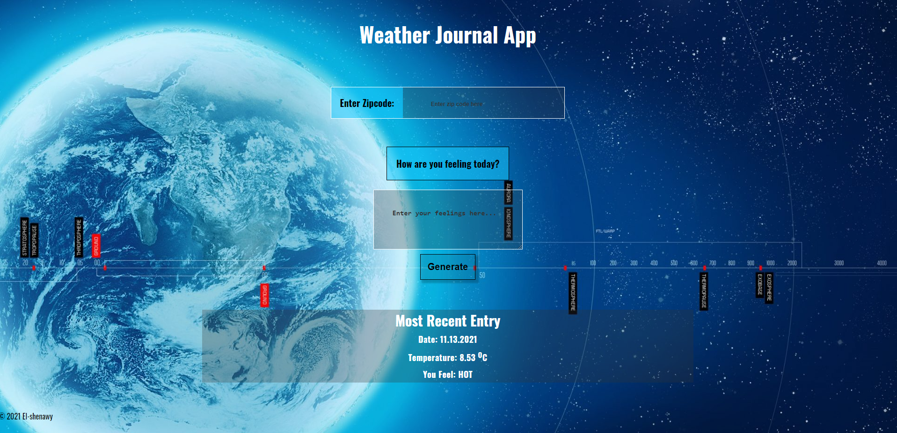

# Weather-Journal App Project

## Overview

This project is a asynchronous web app that uses Web API and user data to dynamically update the UI.

## Instructions

1.Type the zip code for your country (USA)
2.Type What You Feel
3.Then have fun with the result ;)

- Project Link: fwd-weather--app.herokuapp.com

---

## Project files

- server.js
- website
  - app.js
  - index.html
  - style.css
  - imgs

---

## Project Environment Setup

- Node and Express Environment

  - Node and Express installed on the local machine. The project file server.js is require express(), and create an instance of their app using express.
    The Express app instance should be pointed to the project folder with .html, .css, and .js files.

- Project Dependencies
  - The ‘cors’ package is installed in the project from the command line, required in the project file server.js, and the instance of the app should be setup to use cors().
    The body-parser package installed and included in the project.
  - added nodemon to automatically restart the server
- Local Server
  -Local server is running and producing feedback to the Command Line through a working callback function.

- API Credentials

  - Created API credentials on OpenWeatherMap.com

  ***

  ## APIs and Routes

- APP API Endpoint
  - There is a JavaScript Object named projectData initiated in the file server.jsto act as the app API endpoint.
- Integrating OpenWeatherMap API
  - The personal API Key for OpenWeatherMap API is saved in a named const variable.
  - The API Key variable is passed as a parameter to fetch() .
  - Data is successfully returned from the external API.
- Return Endpoint Data
- GET Route I: Server Side

  - There is a GET route setup on the server side with the first argument as a string naming the route, and the second argument a callback function to return the JS object created at the top of server code.

- Return Endpoint Data
- GET Route II: Client Side
  - There is an asynchronous function to fetch the data from the app endpoint
- POST Route
  - Add an entry to the project endpoint using a POST route setup on the server side and executed on the client side as an asynchronous function.

---

## Dynamic UI

- Naming HTML Inputs and Buttons For Interaction

  - The input element with the placeholder property set to “enter zip code here” should have an id of zip.
  - The textarea included in project HTML should have an id of feelings.
  - The button included in project HTML should have an id of generate.

- Assigning Element Properties Dynamically

  - The div with the id, entryHolder should have three child divs with the ids:
  - date
  - temp
  - content

- Event Listeners
  - Added event listener to an existing HTML button from DOM using Vanilla JS.
  - In the file app.js, the element with the id of generate have an addEventListener() method called on it, with click as the first parameter, and a named callback function as the second parameter.
- Dynamically Update UI
  - Sets the properties of existing HTML elements from the DOM using Vanilla JavaScript.
  - Included in the async function to retrieve that app’s data on the client side, existing DOM elements should have their innerHTML properties dynamically set according to data returned by the app route.

---

## Final Result

